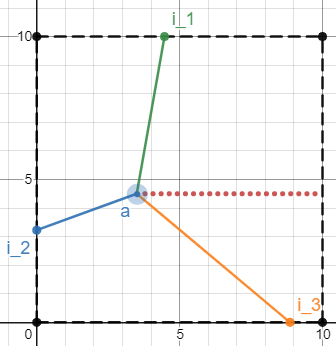

# Instructions

Lidar stands for Light Detection and Ranging and uses pulsed lasers to measure distances.
It is used in many positioning systems such as self driving cars. Consider the case where
a robot is positioned in a square and takes 3 measurements to determine it's position.
Write a function that takes the square side length and three distances and determines a
valid position for the robot within the square. The measurements are spread out evenly,
such that the angle between any two of them is 120 degrees.

The function `lidar()` should take the sideLength as an argument and a list of the three
distances. It should return a tuple of the x coordinate, y coordinate, and angle relative
to the horizontal axis. Assume the lower left corner of the square is at (0, 0).

Note: there will be multiple valid positions, just return one that works.

An example for a lidar position with a side length of 10.
The solid lines are the measurements, and the red line is the horizontal axis (for determining the angle).
